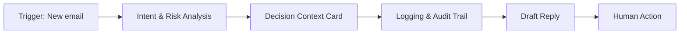

# Architecture

This repository documents a human-in-the-loop decision-support agent for operational email triage. The system does **not** execute actions; it prepares decision context for a human operator.

## Decision Flow (Mermaid)

## Notes
- Drafts are suggestions, never auto-sent.
- Logging captures decision artifacts, not sensitive content.
